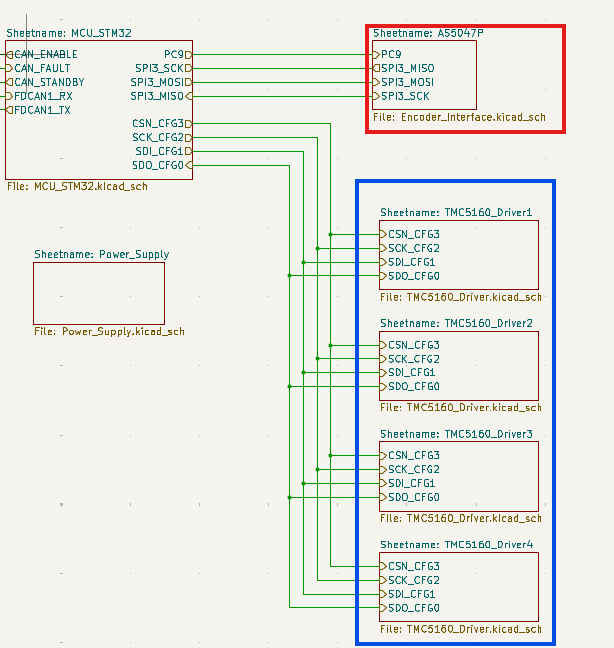

# Stepper Driver Firmware for Project STORM

This project contains the firmware for UCF Robotics custom stepper motor controllers which are being designed for Project STORM.

## Getting Started

This project is heavly dependent on cmake and STM32's proprietary libraries for the STMG474. Heres a list of all the tools we use.

- [CMake](https://cmake.org/download/)
- [STM32CubeMX](https://www.st.com/en/development-tools/stm32cubemx.html)
- [ARM GNU Toolchain](https://gitlab.arm.com/tooling/gnu-toolchains-for-arm/-/tree/releases/15.3.rel1?ref_type=heads)

*If you want to get started developing you will need all three of the tool listed above. I hyperlinked all the names so you can just download them by clicking on their name.*

> [!NOTE]
> If you are using VSCode I **strongly suggest** you also install the [STM32CubeIDE extension pack](https://marketplace.visualstudio.com/items?itemName=stmicroelectronics.stm32-vscode-extension) from the VSCode marketplace. The normal clangd and c++ intelisesne extenstions have a hard time detecting STM32's proprietary libraries that are necessary to build the project.

### Configuring CMake and Compiling the project

Lastly, after everything is installed you will need to configure cmake so it will know how to compile the project properly. The command below will configure the project to use a toolchain file provided from STM. Without it cmake won't properly compile an elf file using arm instructions.

```sh
cmake -B ./build -DCMAKE_TOOLCHAIN_FILE=cmake/gcc-arm-none-eabi.cmake -S .
```

After its configured we can compile our code by running the command below. Which will just put all of the build files into a dedicated build folder.

```sh
cmake --build build
```

## Project Structure

The project has four directories that are important for the firmware

- Core
  - Inc
  - Src
- Drivers
- Middleware

### `Core`

This is the main folder for the project all the code will be written in core and split between `Inc` and `Src`. `Inc` is where all of the header files will be stored and `Src` will be for the actuall c code that will implement the functions declared in our headers. The main project file is `main.c` and `main.h`

### `Drivers` and `Middleware`

This houses all the STM32 libraries that control chip functions on the MCU called the HAL_Drivers and the RTOS abstraction layer we will be using to interface with FreeRtos called CMSIS.

## General Board Components

- MCU: [STM32 G474](https://www.st.com/resource/en/datasheet/stm32g474re.pdf)
- Stepper Motor Drivers: [TMC5160A](https://www.analog.com/media/en/technical-documentation/data-sheets/TMC5160A_datasheet_rev1.18.pdf)
- Magnetic Encoder: [AS5047P](https://look.ams-osram.com/m/d05ee39221f9857/original/AS5047P-DS000324.pdf)

## Architectural Overview

The STM32 G474 will be connected to both the magnetic encoder and the motor drivers via two independent SPI busses. Will will have four of the TMC5160A motor drivers on SPI1 bus while the Magnetic encoder will be on SPI3.

The magnetic encoder is highlighed in red while the motor drivers are highlighted in blue.


